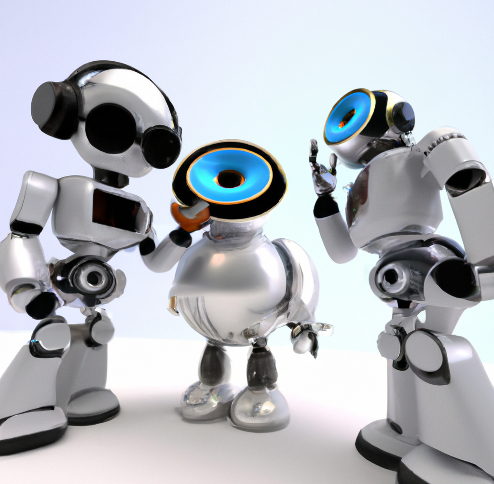

Sound in human-robot interaction currently encompasses a wide range of approaches and methodologies that is not easily classified, analyzed, or compared between projects. This edited book covers the state-of-the-art in sound and robotics aiming to collect existing approaches in a combined volume. Collecting chapters from world-leading academic and industry authors, the book also includes surveys of the existing work in sound and robotics. The first set of chapters explores how robots use and listen to verbal communication, considering the merits and disadvantages of speech for human-robot interaction. The second section shifts to the roles of non-verbal communication in HRI, including a look at industry practice, consequential sound, sonification and audio cues. The third and final section describes current approaches to robotic musicianship, from improving trust, to technical and creative perspectives such as singing robots, and dancing to music. 

This website will include videos and related audio clips for each chapter.

Expected release date: Mid-2023

Edited by Richard Savery, [contact here](https://richardsavery.com/contact)

